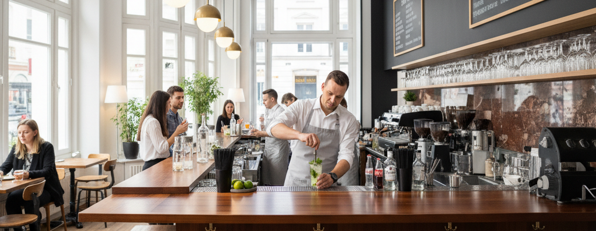

## 🍹 Mojito GSAP Practice

A visually stunning and dynamic landing page built to master professional web animations. This project showcases smooth transitions and complex visual effects triggered by user interaction.

## ✨ Features

- GSAP Animations: Leverages the GreenSock Animation Platform to - create high-performance timelines and seamless element transitions.
- Parallax Effects: Drink elements and ingredients react to user actions, creating a rich sense of depth and immersion.
- Enhanced UI/UX: Features modern typography and a vibrant color palette tailored to the product's refreshing theme.
- Interactive Experience: Every click or scroll event is paired with thoughtful visual feedback to engage the user.
- Fully Responsive: Animations and layouts are optimized to function correctly across all device types.

## 🛠️ Tech Stack

- HTML5 & CSS3: Semantic structure and advanced styling, including complex absolute/relative positioning for animated layers.
- JavaScript (ES6+): Core logic for site interactivity and event handling.
- GSAP (GreenSock Animation Platform): The primary engine used for high-performance object manipulation.
- ScrollTrigger: A powerful GSAP plugin used to sync animations perfectly with the user's scroll position.
